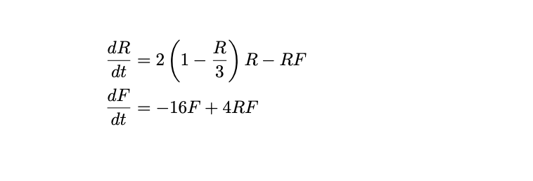
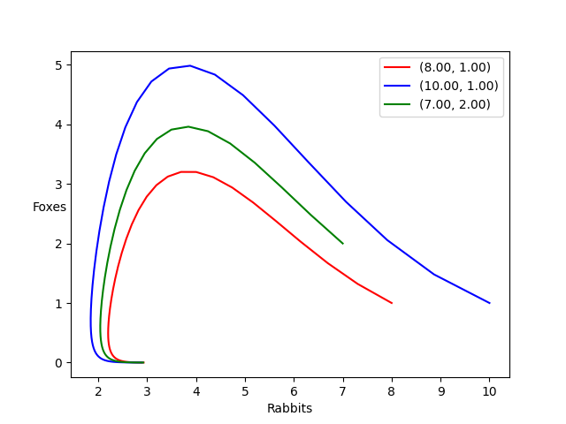

Differential Equations Code
===========================

Here are some scripts I use for creating slope fields and
plotting systems of differential equations using Euler's
method. Below is an example plot of a classic predator-prey
model defined by the following equations

